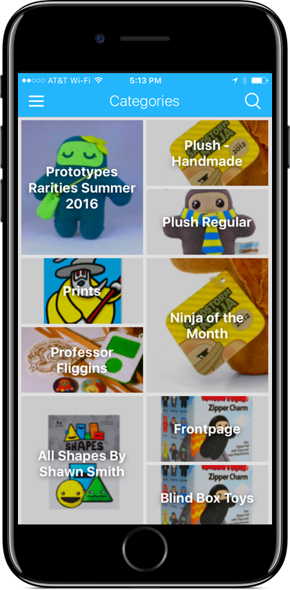
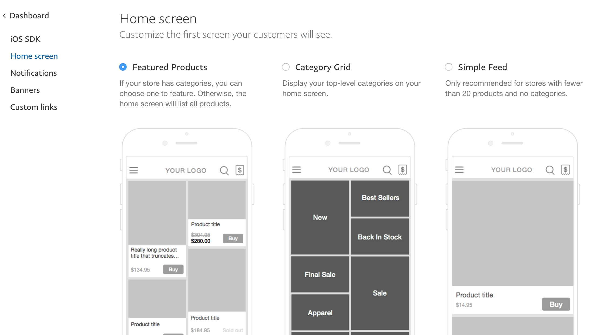

# [fit] API Based
# [fit] Theming
# [fit] of Mobile Apps[^​]

#### by Robert Tolar Haining


[^​]: Disclaimer: The views expressed by Robert Tolar Haining are his own and do<br>not necessarily represent the views of PayPal, its affiliates, or subsidiaries.
I
^
- Name
- API Based Theming of Mobile Apps
- I’m going to start off by giving you a bit of background
  - to provide context for the technical portion in a few minutes

---


^ Product called PayPal Commerce

---


^ - work on a team at Braintree
- a PayPal company

---

# [fit] Contextual
# [fit] Commerce

^ - We focus on Contextual Commerce
- Fancy way of saying we’re building software for retailers to…


---


^ - … sell stuff in places others than their website

---


# [fit] iOS SDK

^ The thing I directly work on is our iOS SDK


---





^ Retailers like Shawnimals ship a standalone mobile commerce app using our SDK…

---


^ and sell toys to their customers

---


---


^ - Retailers like Intelligentsia
- who had an existing app that provided content…

---


^ …and utilities…

---


^ - used our SDK to embed commerce in that app
	- and sell coffee to their customers

---

# [fit] Retailers can
# [fit] customize
# [fit] their shop

^ - We have lots of retailers
- and as you can imagine,
- Each has unique branding

^

^ - We offer various pulleys & levers to customize the shopping experience

---

# Theming Options
- Home screen style
- Colors
- Images
- Fonts

^ - Home screen style
- colors
- images
- Fonts

---


^ - To show off how we theme,
	- I set up a Code Driven app
	- that sells two products:
	- a tote bag
	- & a white t shirt

^ - here are our various home screen styles
	- grid of products

---


^ 	- list of products
		- either could filter to a parent category

---


^ a list of categories

---


^ Now let's take a look at colors.
- Let’s take the buy button
		* a pretty critical part of a retailer’s brand
- Here is an example of ways
- a retailer might modify the color
- of the buy button

---


^ purple

---


^ light blue

---


^ red

---


^ blue

---


^ green

---


^ pink

---


^ but we’ll stick with purple

^

^ - As for images,
		- you can imagine that the logo is pretty central


---


^ - I had some fun modifying the logo

---


^  to be either a white batman logo

---


^ or the full color batman logo

---

# Stored As
# [fit] Key : Value

^ - These resources are stored generically as keys & values.
- Extensible
- Could apply to something like copy in the future

---

# [fit] Configured via
# [fit] PayPal Commerce
# [fit] Control Panel

^ All of this is configured in our Control Panel

---

# [fit] Reasonable
# [fit] Defaults

^ - But with reasonable default values
- Every theme resource has a default

---


^ - Less work to get to a usable product

^

^ - Smart
	* for example if the retailer has not uploaded a logo yet,
	* we’ll show a text label with the retailer’s name

---


^ Default launch screen points you to the panel

---

# [fit] API

^ - All of this saved from the control panel to our database
- Delivered via API to our clients

---

# [fit] Web client backend
# [fit] generates
# [fit] CSS

^ - Web client backend takes that
		* and generates CSS
- Won’t go into detail there

---

# When you open the app, we fetch…
- Access token
- Name, email
- Account flags
- Platform flags
- Products
- Payment methods

^ - when you launch an app
- SDK fetches a bunch of data from the API
…

---

# And also…
- Shipping addresses
- Shipping promotions
- Store info
- Billable countries
- Shippable countries
- Account identifiers

^ everything we need to start selling

---

# [fit] And The Theme

^ including the theme

---

# Theme
- Colors
- Image URLs
- Home screen style

^ - Colors
- Image URLs
- Home screen style

---

# JSON: Accent Color

```javascript
{
	"store_resource_type_id": 1,
	"resource_type": {
		"id": 1,
		"key": "accent_color",
		"name": "Accent color",
		"description": "The links in your app.",
		"default_value": "#009CDE",
		"is_image": false
	},
	"id": 505,
	"value": "#00bfff"
}
```

^ - A couple quick example of what this looks like
- internal resource type id
- links to the resource type
	* the key, in this case “accent color”
	* internal name & description
	* the default value
	* that this is not an image

^

^ - actual resource id
- the color hex value that the retailer has chosen

---

# JSON: Header Logo

```javascript
{
	"store_resource_type_id": 10,
	"resource_type": {
		"id": 10,
		"key": "logo_header",
		"name": "Header logo",
		"description": "This logo will appear in the header.",
		"default_value": "",
		"is_image": true
	},
	"id": 123,
	"value": "https://example.com/code_driven_logo.png"
}
```

^ - same keys
- header logo
- no default value
	* defaults to a text label with the store name
- then the value here is a URL that points to an image

---

# Home screen style
```javascript
{
	"home_screen_parent_id": "home_goods",
	"home_screen_type": "small_products"
}
```

^ - home screen style
- looks different
- in this case, we’re showing small products
- that belong to the “Home goods” category

---

# How does this get consumed?

^  How does this get consumed?

---

# iOS SDK Classes
- Store Resource Model
- Theme Helper
- Themed Image View

^ - a few relevant classes
- store resource
- theme: sort of helper class
- themed image view

---

# Store Resource Model
- Simple
- Translates JSON from the API to Objective-C

^ - Simple
- Translates JSON from the API to Objective-C

---

# Theme Helper Class
- Maintains the key-value pairs in memory
- Saves data locally with `NSUserDefaults`
- Converts colors from Hex to RGB to `UIColor`

^ - maintains a dictionary of key-value pairs in memory
- saves the color values & image URLs locally in NSUserDefaults
	* simple, lightweight key/value store that Apple provides in iOS
- handles converting Hex to RGB to native UIColor

---

# Themed Image View Class
- Subclass of `UIImageView`
- Initialized with an image key
- Downloads image
- Caches image
- Displays image

^ - subclasses UIImageView, which is the native way to display images
- initialized with an image key
- handles downloading/caching of image
- also renders it

---

# What happens when the theme refreshes?

^ What happens when the theme refreshes?

---

## User Interface
# [fit] Dynamically
## Updates

^ Relevant UI will dynamically update when there’s a theme update

---

### `NSNotificationCenter`

^ - We use Apple’s Notification Center for this
- Classes can watch for updates, and refresh relevant UI

---

# Theme Helper Class

```objectivec
+(void)saveStoreResources:(NSArray *)resources{
	// …
	[[NSNotificationCenter defaultCenter]
	 postNotificationName:ThemeDidUpdateNotification
	 			   object:nil];
}
```

^ - here in our theme helper class
- after we get an updated theme,
		* and save our resources,
		* we post a notification that the theme did update
		* that will notify relevant UI

---

# Buy Button Class

```objectivec
+(instancetype)new{
	// …
	[[NSNotificationCenter defaultCenter]
	 addObserver:button
		selector:@selector(didUpdateTheme:)
			name:ThemeDidUpdateNotification
		  object:nil];
	// …
}
```

^ Here is an example of how the buy button observes notifications for our theme updates

---
# Buy Button Class

```objectivec
-(void)didUpdateTheme:(NSNotification *)notification{
   [self updateBuyButtonColor];
}

```

^ And then the buy button simply refreshes its own color to reflect the updates

---


^ - We’ve all been on a bad connection
	* whether on the subway
	* or the back of a grocery store
- But what happens then?

---

# Offline

- Embedded configuration file: `plist`
- Local cache: `NSUserDefaults`

^ - The first time an app is launched,
	* we use an embedded configuration file.
- In iOS, this is a plist, or “property list”,
	* which is just a form of serialized data.

^

^ - Later, after we have downloaded the theme from the API,
	* we will cache that data using NSUserDefaults,
	* and we will use that in subsequent sessions.

---

# [fit] API:
# [fit] source of truth

^ - But the API is always our source of truth
- & supplants anything we had before.

---

# [fit] How do
# retailers
# [fit] configure it all?

^ How do retailers configure it all?

---

# Control Panel

^ Our Control Panel

^ Let’s take a look at what the Control Panel looks like

---


^ - Here you can see a few of the color options & the logo.
- The iOS tab includes even more fine-grained options

---



^  Here we have the various styles for how to customize your home screen

---


^ - And this is what it ends up looking like.
- Grid of products
…

---


^  The “Code Driven” logo up top

---


^ The navigation buttons are white on a black background

---


^  The banner color is blue

---


^ And the buy button is purple to match the logo

---

# Review

1. Retailers modifies theme in Control Panel
1. API stores theme in database
1. Customer opens app
1. iOS SDK fetches theme from API
1. The SDK refreshes its User Interface

^ - Retailers modifies theme in Control Panel
- API stores theme in database
- Customer opens app
- iOS SDK fetches theme from API
- then the SDK refreshes the UI

---


^ - Let’s flip over to a little demo.
- We are going to update the buy button color in the Panel
- And see the refreshed UI in the Simulator

---

# [fit] Fonts

^ - We handle Fonts a bit differently
- We only look at the embedded config plist that ships with the app
	* not the API
- for a couple of reasons
		* Custom fonts will need to be embedded in the app
			** so it makes sense to specify them in the shipped app
		* iOS fonts can be particular to iOS,
			** so we don’t necessarily want the same applied to each client

---

# [fit] Reasonable Defaults
# iOS "system font"
- iOS 8: Helvetica Neue
- iOS 9+: San Francisco

^ - We default to the iOS system font
- Which on iOS 8, is Helvetica Neue
- And iOS 9+ is San Francisco

---


^ - Back to our Code Driven app
- Since this is iOS 10
- we have the default of San Francisco

---


^ - But if we wanted to change that
- Here’s what the local config file looks like
- You can see each of the weights represented here
- If you set it to another font, such as Apple SD Gothic

---


^ - The UI updates accordingly
- But maybe that’s not as pronounced a change to notice the effects

---


^ Here, we specify Didot

---


^ - And here we are
- quite different now

---

# Custom Fonts

^ - But what if we want something Apple doesn’t provide
- It requires a bit more setup on the project side
	- that i won’t go into in detail right now

---

# Nova Mono
- From Google Fonts
- SIL Open Font License
- https://fonts.google.com/specimen/Nova+Mono

^ - I downloaded Nova Mono from Google Fonts
- Under Open Font License

---


^ Here you can see it applied directly across the UI

---

# Font Helper Class
```objectivec
+(UIFont *)fontOfSize:(CGFloat)fontSize;

+(UIFont *)thinFontOfSize:(CGFloat)fontSize;
+(UIFont *)lightFontOfSize:(CGFloat)fontSize;

+(UIFont *)mediumFontOfSize:(CGFloat)fontSize;
+(UIFont *)boldFontOfSize:(CGFloat)fontSize;
```

^ - What does this look like in practice?
- All of our fonts come from this helper class
- We specify the weight and the size

---

# Typos or missing files
- Simply fall back to the default system font.

^ - In case there is a typo in the font name configuration
- or if the custom file wasn’t included properly
- We simply fall back to the default font.

---


^ - Let’s check out how the fonts work in action.
- We are going to set a custom font.
- And run the app to see it take effect.

---

# [fit] Why should
# [fit] you care?

^ - You might ask yourself: why do I care?
- If you only have one mobile app or website,
		* this might not pertain to you.
- But you don’t need to have tons of apps to make this worthwhile.
- Your API could simply be a JSON file,
		* that then powers an iphone app, an android app, & generates CSS for a website.
- Then any style changes automatically propagate across all of your clients.

---

# *Thanks!*
## Robert Tolar Haining
### tolar@braintreepayments.com
###  @tolar
### paypal.com/commerce

^ - Thanks for your time!
- You can find me on the interwebs here
- and you can read more about paypal commerce on the web at paypal.com/commerce  
